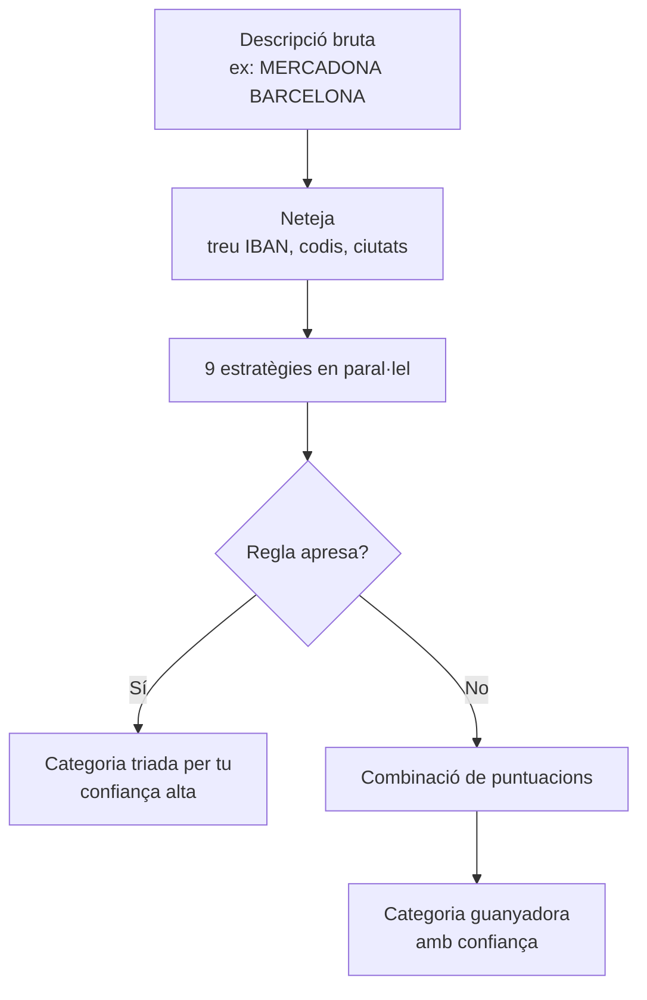

# Auto-categorització

Quan importes un CSV del banc, el sistema llegeix cada descripció (`MERCADONA BARCELONA`, `BAR CANARIAS`, `AMAZON ES123…`) i decideix a quina categoria ha d'anar (`Alimentació`, `Restaurants i oci`, `Compres`…). Això s'anomena **auto-categorització** i estalvia haver de triar manualment cada fila.

## En 30 segons

1. El sistema neteja la descripció (treu codis de banc, IBAN, ciutats, etc.).
2. Aplica 9 estratègies diferents en paral·lel.
3. Les puntuacions es combinen i es tria la categoria més probable.
4. Si tu ja has corregit una descripció semblant abans, el sistema ho recorda i l'encerta sempre.

Si la categoria és "alta" confiança (≥ 78 %), s'accepta automàticament. Si és "baixa" o cap, t'ho marca perquè ho revisis tu.

## Com funciona



### Les 9 estratègies

| Estratègia | Què mira | Exemple |
|------------|----------|---------|
| **Prefix** | La descripció comença per `BAR-`, `SUPERMERCAT`, `FARMACIA`… | `BAR CANARIAS` → Restaurants |
| **Merchant exacte** | El negoci és al diccionari (`merchants.ts`) | `MERCADONA` → Alimentació |
| **Merchant aproximat** | El negoci s'assembla a un del diccionari (typos) | `MERCAONA` → Alimentació |
| **Token** | Algun token (paraula) és al diccionari | `taxi` → Transport |
| **IBAN** | El compte és teu (transferència interna) | `ES1234…` → Entre comptes propis |
| **Import** | L'import és típic d'una categoria (lloguer > 400 €) | `hipoteca 850 €` → Habitatge |
| **Income keyword** | Paraules clau d'ingrés (`nòmina`, `dividend`) | `NÒMINA JUNY` → Nòmina |
| **Frequency** | Mateixa descripció vista N vegades amb la mateixa categoria | recurrència |
| **Fallback** | Text molt genèric | `compras varias` → Altres despeses |

Cada estratègia vota amb un pes (0–1). Es combinen amb una OR sorollosa (noisy-OR): si diverses estratègies coincideixen, la confiança puja.

### Confiança

| Nivell | Rang | Què passa |
|--------|------|-----------|
| Alta | ≥ 0.78 | S'accepta automàticament |
| Mitjana | 0.55–0.78 | Es suggereix, marcat per revisar |
| Baixa | 0.32–0.55 | Es suggereix però marcat com a sospitós |
| Cap | < 0.32 | No suggereix res, tu tries |

## Exemples pràctics

### Cas 1 — Encert fàcil

```
MERCADONA BARCELONA          → Alimentació     (alta, 0.92)
BAR CANARIAS                 → Restaurants     (alta, 0.85)
SHELL ES1234                 → Transport       (alta, 0.88)
NETFLIX.COM                  → Subscripcions   (alta, 0.85)
FARMACIA JENE ESPLUGUES      → Salut           (alta, 0.85)
```

### Cas 2 — Conflictes entre estratègies

```
BEAT MAG MUSIC SL L'HOSPITAL → Salut           (alta, 0.83)
```

Aquí el token `hospital` fa pujar Salut, però el negoci real és una botiga de música. El sistema s'equivoca. **Solució**: corregeix manualment un cop — el sistema ho recordarà per sempre (veure "Com ensenyar-li coses noves").

### Cas 3 — Sense informació

```
coses                        → cap categoria   (cap)
rata                         → cap categoria   (cap)
qwzqx qwerty                 → cap categoria   (cap)
```

El sistema no té prou senyals. Tu tries manualment. La primera vegada, el sistema aprèn.

### Cas 4 — Regla apresa (recorregut del temps)

```
Mes 1: REPSOL CUSTOM → Transport (auto, 0.88)
Tu corregeixes: REPSOL CUSTOM → Impostos (perquè és una comissió)

Mes 2 (re-importes el mateix CSV):
REPSOL CUSTOM → Impostos (alta, 0.99 — regla apresa)
```

## Com ensenyar-li coses noves

Tens tres eines. Totes viuen al teu navegador (no cal servidor).

### 1. Corregeix manualment

A la pantalla de Moviments o durant la importació, canvia la categoria d'una fila. El sistema desa una regla local: "aquesta descripció → aquesta categoria". A partir d'ara, sempre que la mateixa descripció aparegui, s'auto-categoritzarà igual.

### 2. Afegeix un comerç nou

Si tens un comerç local que el sistema no coneix, pots afegir-lo al diccionari personal. Per fer-ho, edita `apps/web/src/utils/autoCategorize/merchants.ts` i afegeix el token a la llista de la categoria corresponent:

```ts
{
  categoryName: 'Restaurants i oci',
  tokens: [..., 'el meu bar favorit'],
}
```

Després recompila i la propera importació el reconeixerà.

### 3. Dona més pes a un token

Per defecte, com més llarg és el token, més pesa. Però pots forçar un pes concret:

```ts
{
  categoryName: 'Compres',
  tokens: ['mag', 'pro'],     // massa curts, pesen poc
  weight: 0.85,                // forçar pes alt
}
```

## Limitacions conegudes

- **Descripcions molt genèriques** (`coses`, `rata`) no es poden classificar — cal triar manualment.
- **Negocis amb paraules comunes** (un bar anomenat `HOSPITAL BAR`) es poden confondre amb altres categories.
- **Import sols no és prou**: 60 € pot ser un sopar o un supermercat. El sistema mira principalment la descripció, no l'import.

## On viu el sistema

| Fitxer | Què fa |
|--------|--------|
| `apps/web/src/utils/autoCategorize/` | Tot el sistema (~10 fitxers) |
| `apps/web/src/utils/autoCategorize/merchants.ts` | Diccionari base de comerços |
| `apps/web/src/utils/autoCategorize/prefixes.ts` | Regles de prefix (`BAR-`, `SUPERMERCAT`…) |
| `apps/web/src/views/Import.vue` | Pantalla d'importació amb el dropdown de top-3 |
| `apps/web/src/views/Moviments.vue` | Pantalla de moviments on pots corregir |

L'estat après (regles apreses + extensions del diccionari) viu a `localStorage` del navegador. Si canvies de navegador o esborres les dades, el sistema torna a començar.